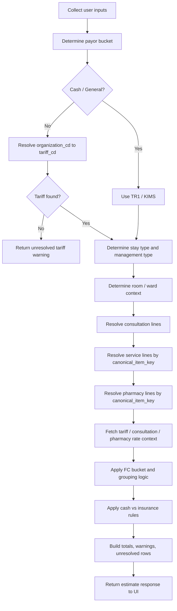

# FC Estimate Flowchart

## End-To-End Flow

1. Collect UI input.
2. Identify payor context.
3. Resolve organization context.
4. Resolve tariff.
5. Resolve stay and management context.
6. Resolve room or ward context.
7. Resolve consultation lines.
8. Resolve service lines.
9. Resolve pharmacy lines.
10. Fetch applicable rates.
11. Apply item-level FC logic.
12. Build totals and warnings.
13. Return estimate payload.

## Decision Flow

## Output Expectations

The builder should return:
- resolved tariff context
- itemized estimate sections
- totals by section and FC bucket
- warnings
- unresolved items that need review
