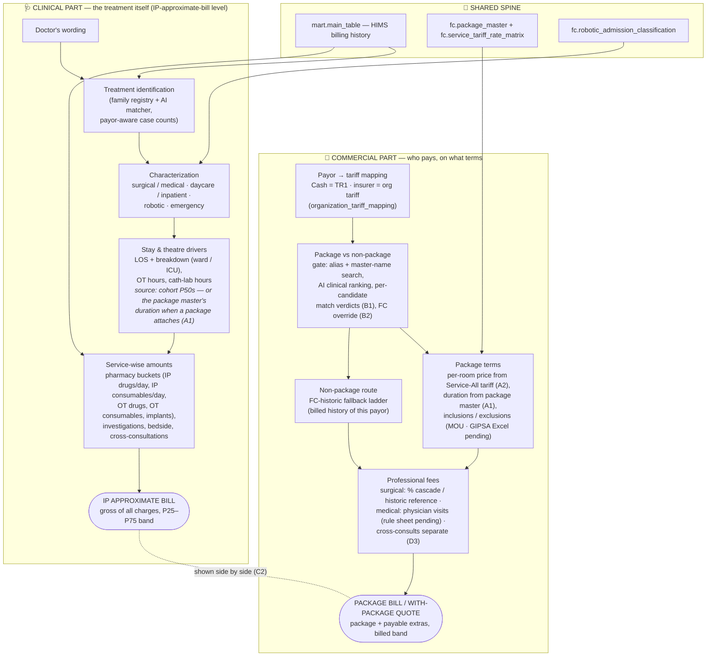

# Estimate pipeline — clinical vs commercial parts

Per the manager's 17-Jul ask: the same estimate, split into the two halves. The clinical part answers *"what happens to the patient and what services does that consume?"* with **no package/PF confusion**; the commercial part answers *"who pays, on what negotiated terms?"*. The UI mirrors this split on the flow-2 results (Clinical/Commercial strip).

## Field provenance (E2)

| Field | Source |
|---|---|
| IP numbers, billed amounts, payor bucket, tariff codes | **HIMS extract** (as billed) |
| Family/template tags, care type, daycare, robotic flags | **derived** by our classification jobs |
| Package prices per room, package duration, pre/post days | **hospital masters** (Service-All tariff, package master) |
| Inclusions/exclusions | MOU extraction (cash/non-GIPSA); GIPSA Excel pending |
| PF | logic + billed history (visit-fee sheet pending for medical) |
